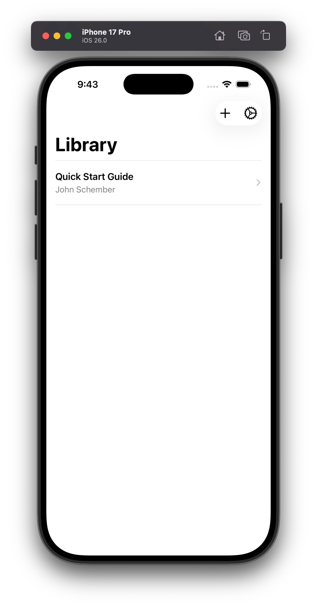
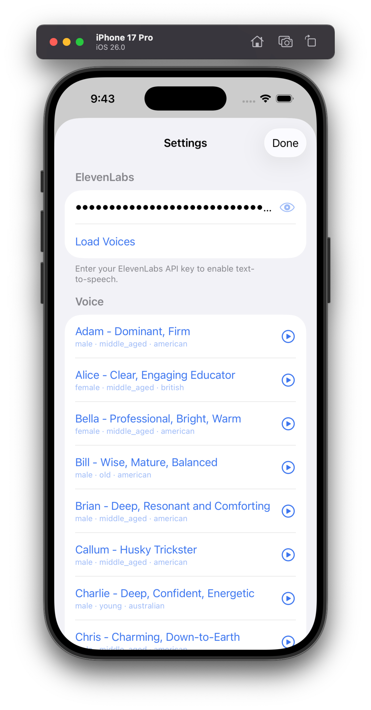

<div align="center">

# 📖 EPUBReader

**Your books, read aloud with the best AI voices.**

*Import any EPUB. Pick a voice. Tap play.*

 &nbsp;&nbsp; 

</div>

A simple iOS app that reads EPUB books out loud using [ElevenLabs](https://elevenlabs.io) text-to-speech. Words are highlighted in real-time as they're spoken — like a personal narrator that follows along with you.

- 🎧 **AI-powered narration** — natural voices from ElevenLabs, not robotic TTS
- 🔦 **Live word highlighting** — see exactly what's being read, word by word
- 📚 **Import any EPUB** — open files from iCloud Drive, Files, email, anywhere
- 🎨 **Themes** — light, dark, sepia, or match your system
- ⏩ **Speed control** — 0.8x to 2.5x playback speed
- 🔊 **Background audio** — keep listening with the screen off

---

## 🔑 You Need

1. **A Mac with Xcode 16+**
2. **An iPhone running iOS 17+** — or just your Apple Silicon Mac (see [Install on Your Mac](#-install-on-your-mac))
3. **An ElevenLabs API key** — [get one here](https://elevenlabs.io) (free tier works)

That's it.

---

## 📲 Install on Your iPhone

### 1. Clone and generate the project

```sh
git clone <this-repo> epub-reader
cd epub-reader
brew install xcodegen    # if you don't have it
xcodegen generate
```

### 2. Open in Xcode

```sh
open EPUBReader.xcodeproj
```

### 3. Set your signing team

- Select the **EPUBReader** target in Xcode
- Go to **Signing & Capabilities**
- Pick your **Personal Team** (your Apple ID works — no paid developer account needed)
- Xcode will auto-create a provisioning profile

### 4. Build and run

- Plug in your iPhone via USB
- Select it as the run destination in the toolbar
- Hit **⌘R** (or the ▶️ button)

> 💡 **First time?** Your phone will say "Untrusted Developer." Go to **Settings → General → VPN & Device Management**, find your profile, and tap **Trust**.

### 5. Add your ElevenLabs API key

- Open the app → tap the ⚙️ gear icon
- Paste your API key
- Tap **Load Voices** and pick one you like

---

## 💻 Install on Your Mac

Apple Silicon Macs run the iOS app natively — no separate Mac version, no extra setup beyond
what the iPhone flow already needs.

```sh
brew install xcodegen    # if you don't have it
make install-mac
```

The app lands in `/Applications` (or `~/Applications` if that's not writable). Launch it from
Spotlight, or:

```sh
open /Applications/EPUBReader.app
```

Other targets: `make build-mac` (build without installing) · `make clean` (drop local build artifacts).

> 🍎 Requires an Apple Silicon Mac (M1 or later) with Xcode signed into your Apple ID
> (**Xcode → Settings → Accounts** — free account works). The install reuses your existing
> development certificate and provisioning profile automatically. If it reports that no profile
> covers your Mac, open this project in Xcode, pick your team, and run it once with destination
> **My Mac (Designed for iPad)** — free accounts get per-app profiles, so it must be this project —
> and retry. With a free account the profile expires after ~7 days (same as the iPhone flow) — if
> the Mac app stops opening, build once from Xcode to refresh it, then `make install-mac` again.
> Intel Macs can't run iOS apps.

---

## 📖 How to Use

1. **Import a book** — tap the **+** button on the Library screen and pick an `.epub` file
2. **Start reading** — tap a book to open it
3. **Play narration** — tap anywhere to show controls, then hit ▶️
4. **Select text to read from** — long-press to select text, then tap "Speak from Here"
5. **Change voice/theme/speed** — use the controls overlay or ⚙️ settings

> 📕 **Need a free EPUB to try?** [Project Gutenberg](https://www.gutenberg.org) and [Standard Ebooks](https://standardebooks.org) have thousands.

---

## 🛠 Tech

| | |
|---|---|
| **UI** | SwiftUI (iOS 17) |
| **EPUB rendering** | [Readium Swift Toolkit](https://github.com/readium/swift-toolkit) 3.7.0 |
| **TTS** | [ElevenLabs API](https://elevenlabs.io/docs/api-reference/text-to-speech) (`eleven_flash_v2_5`) |
| **Audio** | AVAudioPlayer with rate control |
| **Project gen** | [XcodeGen](https://github.com/yonaskolb/XcodeGen) |

---

## 🗂 Project Structure

```
EPUBReader/
├── Models/          # Book data models + persistence
├── Views/           # Library, Reader, Settings screens
├── Services/        # ElevenLabs API, audio playback, EPUB parsing, Readium
└── Helpers/         # TTS highlight positioning
```

---

## 💡 Notes

- **ElevenLabs free tier** gives you ~10,000 characters/month — enough for a few chapters. The app caches audio locally so replaying sections doesn't cost extra API calls.
- **No paid Apple Developer account required.** Free provisioning profiles last 7 days — just re-run from Xcode when they expire.
- **Background playback works.** Lock your phone and the narration keeps going.

---

> This is a personal project I built because I wanted a Speechify-like experience without the subscription. Sharing it in case others find it useful.
